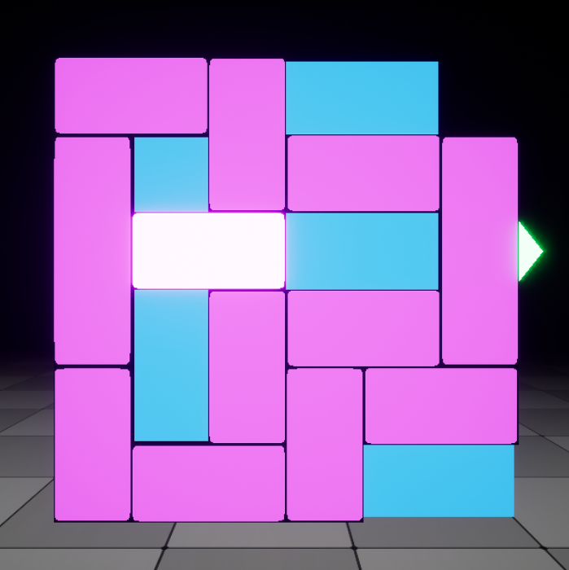

{: width="250" }

# Creating A Custom Puzzle

Block Puzzle uses Data Table for each puzzle generation 

You can generate puzzle random from DataTable or you can create your own puzzle.

The board description is a 36-character string representing the state of the unsolved board. It is a 6x6 2D array in row-major order. The characters in the description follow these simple rules:

o empty cell
x wall (fixed obstacle)
A primary piece (red car)
B - Z all other pieces

