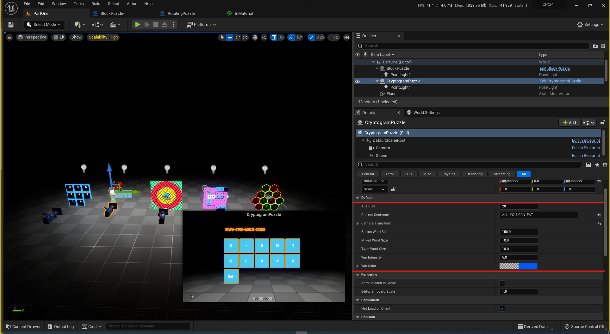

{: width="250" }

# Creating A Custom Puzzle

A cryptogram is a type of puzzle that consists of a short piece of encrypted text. Generally the cipher used to encrypt the text is simple enough that the cryptogram can be solved by hand. https://en.wikipedia.org/wiki/Cryptogram

You can generate puzzle with any sentence or word using "Correct Sentence" setting under CryptogramPuzzle details panel.

