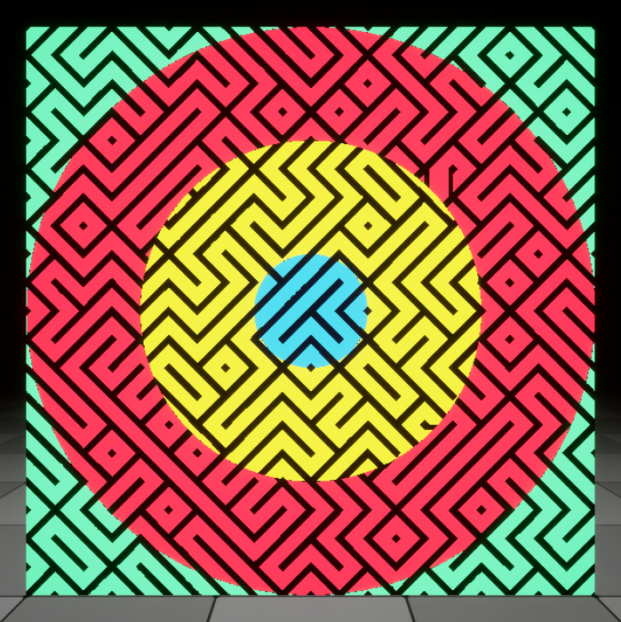
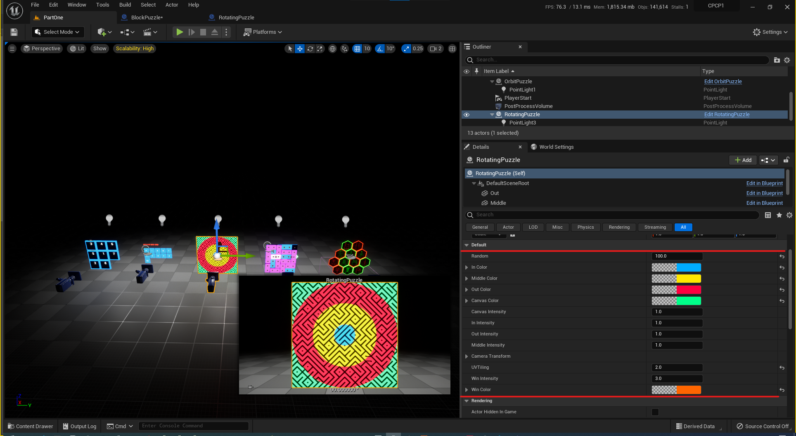

{: width="250" }

# Creating A Custom Puzzle

Rotating puzzle uses procedural material for generating puzzle.

You can use settings under RotatingPuzzle detail panel with Random and UVTiling you can crate differnt puzzles 

