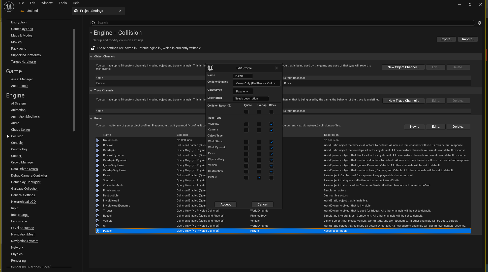
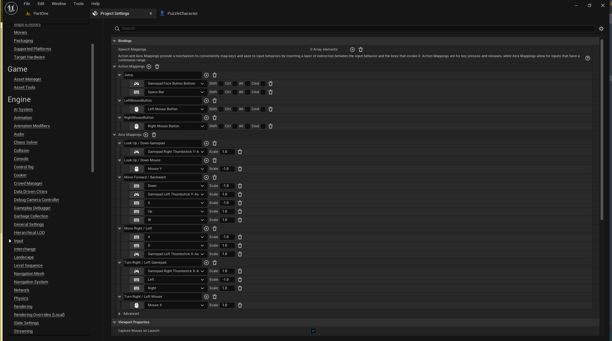
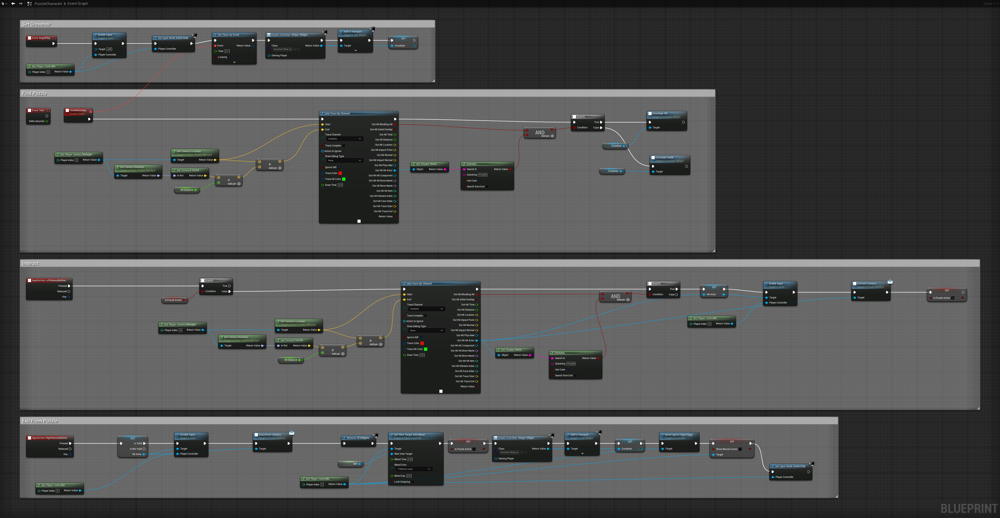
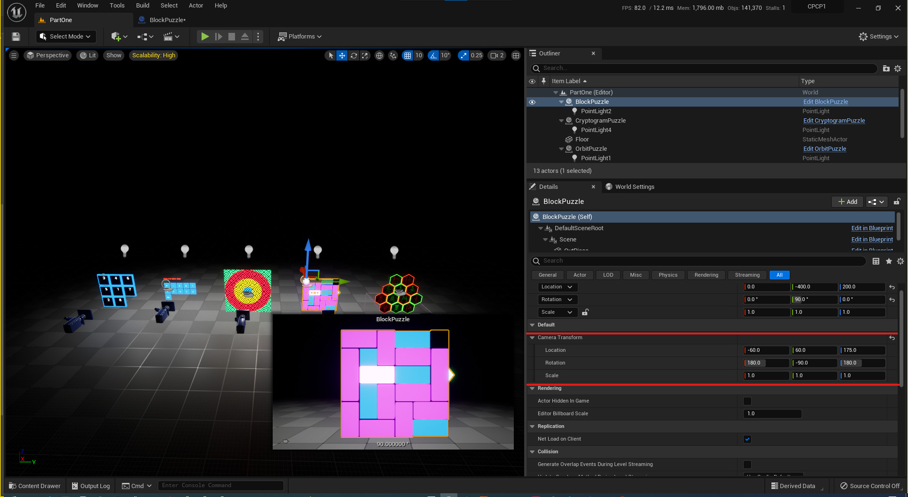
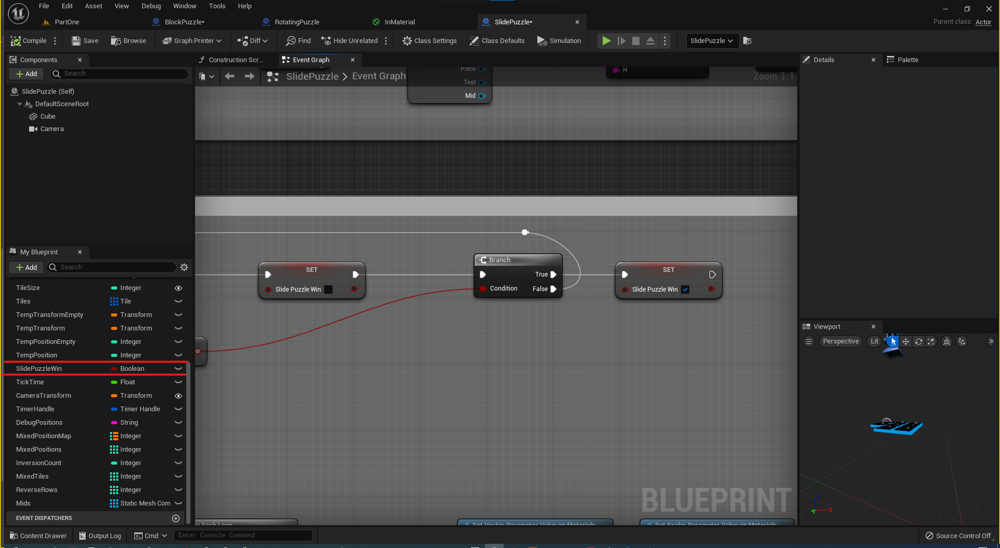

# Collision

<iframe width="560" height="315" src="https://www.youtube.com/embed/UgMtKuf6eFQ" title="YouTube video player" frameborder="0" allow="accelerometer; autoplay; clipboard-write; encrypted-media; gyroscope; picture-in-picture" allowfullscreen></iframe>

# Inputs
If you want you can Import https://github.com/camenduru/Puzzles/blob/gh-pages/assets/ini/inputs.ini file into your project.

# Game Mode

<iframe width="560" height="315" src="https://www.youtube.com/embed/JgqfPFdHSNQ" title="YouTube video player" frameborder="0" allow="accelerometer; autoplay; clipboard-write; encrypted-media; gyroscope; picture-in-picture" allowfullscreen></iframe>

# Integration With Character Controller

PuzzleInterface has only two fucntions ActivateCamera and DeactivateCamera you can activate and deactivate puzzles with those functions. 

- First we are looking at display names in the map for substring "Puzzle"
- For activating puzzles we are calling ActivateCamera (Target is PuzzleInterface) then we are setting "Is Puzzle Active" to True 
- For deactivating puzzle we are calling DeactivateCamera (Target is PuzzleInterface) then we are setting "Is Puzzle Active" to False

# Example Character Blueprint

# Puzzle Camera World Position

# Puzzle Win Condition

Each puzzle has own win condition you can make win boolean to public and integrate to your own game (like open a door if puzzle condision true).

